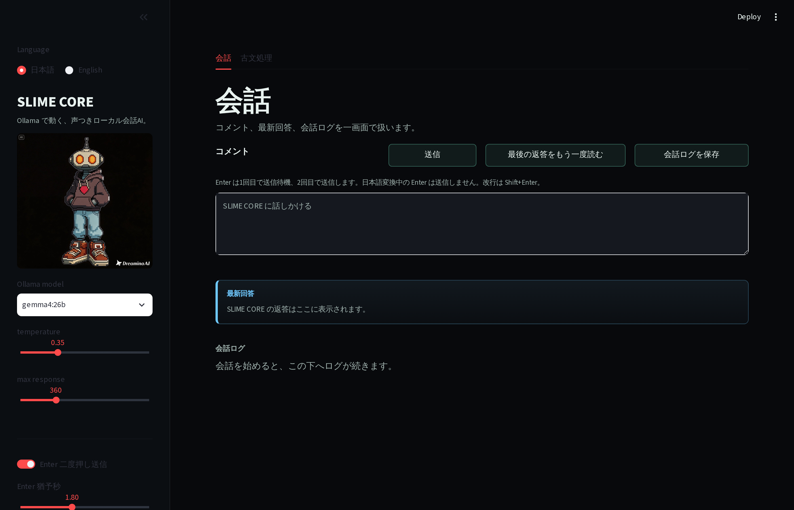
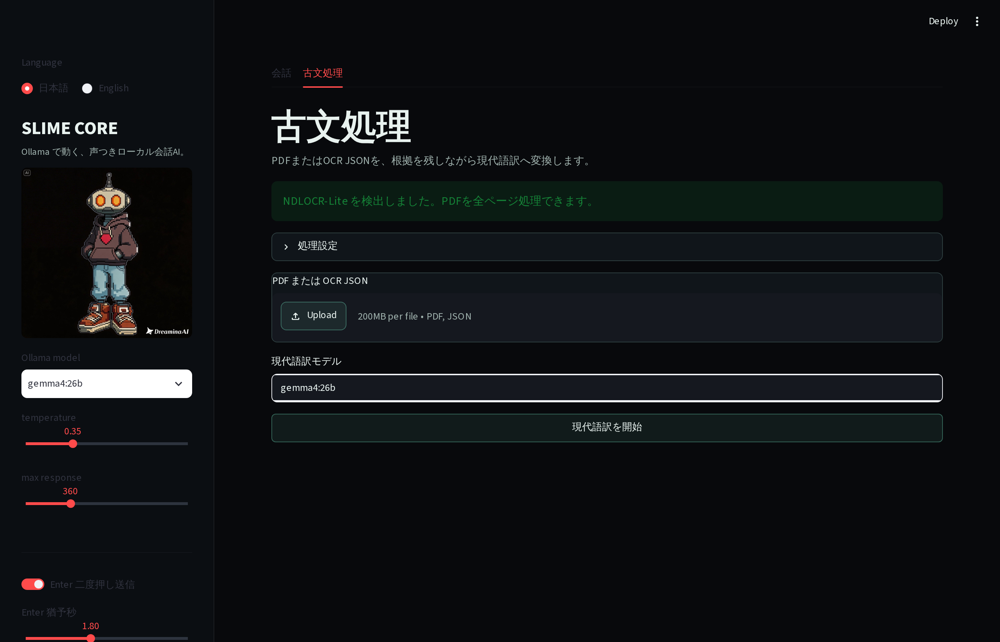

# SLIME CORE lunch

Ollama 経由で動く、音声読み上げつきの Slimecore です。通常会話に加えて、古文資料をPDFまたはOCR JSONから現代語訳へ変換できます。

「lunch」は手軽さ（お昼ごはんのように軽く使える）と起動（launch）の掛詞です。

## 画面

**会話タブ**



**古文処理タブ**



## 入っているもの

- `app.py` : Streamlit の会話アプリ
- `assets/slimecore_flat.jpeg` : キャラクター画像
- `requirements.txt` : 必要な Python パッケージ
- `launch.command` : Finder から起動するためのファイル
- `data/chats/` : 会話ログ保存先
- `modules/` : 古文処理パイプライン
- `app_config.json` : OCR・PDF・フィルタ・Ollamaの設定
- `outputs/` : 古文処理セッションの保存先
- `tests/` : 信頼度判定と訳文組み立ての自動テスト
- `last_launch.log` : 直近の起動ログ
- `SPEC_JA.md` : 詳細仕様書

## 起動

Finder で `launch.command` をダブルクリックしてください。

ターミナルから起動する場合:

```bash
cd ~/Desktop/SLIMEcore_lun
./launch.command
```

ブラウザは自動で開きます。通常は次のアドレスです。

```text
http://localhost:8502
```

もし `Port 8502 is already in use` と出る場合は、起動ファイルが自動で `8503`, `8504`... のように空いている番号へ切り替えます。サーバーが応答できるようになってからブラウザを開きます。

うまく開かない場合は、同じフォルダーの `last_launch.log` に起動ログが残ります。

## Ollama

起動時に Ollama が止まっていれば `ollama serve` を試します。モデルはアプリ内のサイドバーから選べます。既定は `gemma4:26b` です。

すでに入っているモデルを使う場合は追加作業なしで動きます。新しく入れる場合:

```bash
ollama pull gemma4:26b
```

## 入力と表示

画面はサイドバー＋メインの2カラム構成です。サイドバー上部の `Language` で日本語 / English を切り替えられます。メイン領域は次の順番です。

1. コメント欄
2. コメントの真下に最新回答
3. その下に会話ログ

Enter 送信は日本語変換に合わせた二度押し方式です。

- Enter 1回目: 送信待機
- Enter 2回目: AIへ送信
- 日本語変換中の Enter: 送信しません
- Shift+Enter: 改行
- サイドバーで Enter 二度押し送信の ON/OFF と猶予秒を調整できます

Enter 1回目の待機中は、送信ボタンが「もう一度 Enter で送信」または「Press Enter again to send」に変わり、色のフェードで残り時間を示します。

## 表示の安定性

上部の大見出しは日本語フォントで見切れないよう、余白と行高を広めに取っています。

## 応答中

Ollama の応答待ち中は、最新回答エリアに「考えています...」を表示し、コメント欄と送信ボタンを一時的に無効化します。

## 会話ログ

画面表示は直近40メッセージまでです。古い会話がある場合は「（古い会話は省略されています）」と表示します。

JSONログには古い会話も残します。ログファイルはセッション開始時の日付で作成し、日をまたいでも同一セッション中は同じファイルへ保存します。

## 音声

macOS の `say` コマンドで返答を読み上げます。サイドバーで次を調整できます。

- 自動読み上げ ON/OFF
- 声の種類
- 読み上げ速度

ボタン `最後の返答をもう一度読む` で再読み上げできます。返答が900文字を超える場合、読み上げは先頭900文字までになり、最新回答エリアに注記を表示します。

## 古文処理

画面上部の「古文処理」タブからPDFまたはNDLOCR形式のJSONを選択できます。

- PDF: 全ページをPNGへ変換し、NDLOCR-Liteでページ単位のOCRを行います。
- OCR JSON: NDLOCR-Liteが未導入でも、信頼度判定と現代語訳の処理を確認できます。
- 低信頼度行または日本語文字比率が低い行は、推測で補わず `(原文不明瞭)` として訳文へ残します。
- 結果は `outputs/<session_id>/` に保存され、`translation.txt`、`manifest.json`、ページ画像、OCR JSON、フィルタ結果を含みます。

PDF処理にはNDLOCR-Liteと `pdftoppm` が必要です。標準構成では、アプリ内の `tools/ndlocr-lite-run` から専用のPython環境に導入したNDLOCR-Liteを起動します。導入手順は下の「[NDLOCR-Lite の導入](#ndlocr-lite-の導入)」を参照してください。

古文処理はバックグラウンドで実行されるため、処理中も会話タブを利用できます。

## NDLOCR-Lite の導入

PDFから読み取る場合のみ必要です。OCR JSONを読み込むだけなら、この手順は不要です。

NDLOCR-Lite は国立国会図書館が公開しているOCRソフトウェアです（CC BY 4.0）。GPUがなくてもCPUだけで動きます。

- リポジトリ: <https://github.com/ndl-lab/ndlocr-lite>
- 使い方の解説: <https://lab.ndl.go.jp/data_set/ndlocrlite-usage/>

このアプリは NDLOCR-Lite を**外部コマンドとして呼び出す**構成です。アプリ本体とは別のPython環境に入れるので、`requirements.txt` の依存関係と衝突しません。

### 1. Poppler を入れる（`pdftoppm` / `pdfinfo`）

PDFをページ画像へ変換するために使います。

```bash
brew install poppler
pdftoppm -v
```

### 2. NDLOCR-Lite を専用の環境へ入れる

Python 3.10 以上が必要です。ここでは `~/tools/ndlocr-lite` に置く例を示します。

```bash
mkdir -p ~/tools
cd ~/tools
git clone https://github.com/ndl-lab/ndlocr-lite.git
cd ndlocr-lite
python3 -m venv .venv
.venv/bin/python -m pip install --upgrade pip
.venv/bin/python -m pip install -r requirements.txt
```

単体で動くか確認します。

```bash
cd ~/tools/ndlocr-lite/src
../.venv/bin/python ocr.py --sourceimg /path/to/page.png --output /tmp/ndlocr-test --json-only
ls /tmp/ndlocr-test
```

`/tmp/ndlocr-test/page.json` ができれば成功です。初回はモデルの読み込みで時間がかかります。

> GUI版（`ndlocr_lite_gui.exe` などの配布ファイル）はマウス操作用で、このアプリからは呼び出せません。上記のソース版を使ってください。

### 3. ラッパースクリプトを置く

アプリは `tools/ndlocr-lite-run` を実行します。SLIMEcore のフォルダー内に次のファイルを作ります。

```bash
mkdir -p ~/Desktop/SLIMEcore_lun/tools
cat > ~/Desktop/SLIMEcore_lun/tools/ndlocr-lite-run <<'EOF'
#!/bin/bash
# NDLOCR-Lite を専用のPython環境で起動する
set -euo pipefail
NDLOCR_DIR="$HOME/tools/ndlocr-lite"
cd "$NDLOCR_DIR/src"
exec "$NDLOCR_DIR/.venv/bin/python" ocr.py "$@"
EOF
chmod +x ~/Desktop/SLIMEcore_lun/tools/ndlocr-lite-run
```

`cd` していますが、アプリが渡す画像パスと出力先は絶対パスなので問題ありません。

> **`chmod +x` を忘れないでください。** アプリはファイルの存在だけを見て「導入済み」と判定します。実行権限がないと、画面上は導入済みに見えたまま、処理の途中で「文字の読み取りに失敗しました」になります。

### 4. アプリ側で確認する

アプリを起動して「古文処理」タブを開きます。

- 導入済み: 「NDLOCR-Lite を検出しました。PDFを全ページ処理できます。」（緑）
- 未導入: NDLOCR-Lite が見つからない旨の警告（黄）。この状態でもOCR JSONの読み込みは使えます。

### 設定の変更

`app_config.json` の `ocr` セクションで呼び出し方を変えられます。

```json
"ocr": {
  "binary": "tools/ndlocr-lite-run",
  "args": ["--sourceimg", "{input}", "--output", "{output}", "--json-only"],
  "timeout_seconds": 300
}
```

- `binary`: 相対パスならアプリのフォルダーからの相対、絶対パスや `~` も使えます。`/` を含まない場合は `PATH` から探します（`uv tool install .` で入れた `ndlocr-lite` コマンドをそのまま指定する構成も可能です）。
- `args`: `{input}` にページ画像、`{output}` に一時ディレクトリが入ります。アプリは `{output}/<画像名>.json` を読みます。
- `timeout_seconds`: 1ページあたりの上限。ページが重い場合は延ばしてください。

期待するJSONの形は NDLOCR-Lite の出力そのままです。

```json
{
  "contents": [[{ "id": 0, "text": "...", "confidence": 0.93, "boundingBox": [[0,0],[0,0],[0,0],[0,0]] }]],
  "imginfo": { "img_width": 1200, "img_height": 1800, "img_path": "...", "img_name": "page_0001.png" }
}
```

`confidence` が `confidence_filter` のしきい値（既定 0.5）を下回る行は、推測で埋めずに `(原文不明瞭)` として訳文に残します。

### うまくいかないとき

| 症状 | 原因と対処 |
| --- | --- |
| 「NDLOCR-Liteが見つかりません」 | `tools/ndlocr-lite-run` のパスを確認。`app_config.json` の `ocr.binary` と一致しているか。 |
| 「正しくインストールされているか確認してください」 | 実行権限（`chmod +x`）か、NDLOCR-Lite側の依存不足。手順2のコマンドを単体で実行して確認。 |
| 「読み取り結果の形式が想定と異なります」 | `--json-only` が抜けている、または出力先に他のJSONが混ざっている。 |
| 「時間がかかりすぎています」 | `timeout_seconds` を延ばす。ページ数を減らす。 |
| `pdftoppm: command not found` | `brew install poppler`。 |

## 検証

~~~bash
cd ~/Desktop/SLIMEcore_lun
.venv/bin/python -m unittest discover -s tests -v
~~~

## 仕様書

詳細仕様は `SPEC_JA.md` にまとめています。
