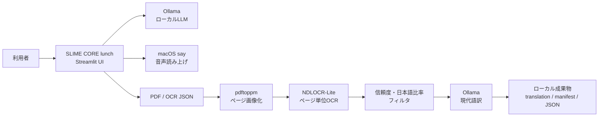

# SLIME CORE lunch アプリ企画書

**版:** 1.0  
**対象:** macOSでローカルAIを日常利用したい個人・小規模チーム  
**作成日:** 2026-07-31

## 1. 企画概要

SLIME CORE lunch は、Mac上で動くOllamaを会話エンジンとして利用し、音声での読み上げと古文資料の現代語訳を一つにまとめたローカルAIアプリです。

外部のクラウドAIへ会話や資料本文を送らず、日常の相談、文章の下書き、資料読解を軽い操作で始められることを目指します。「lunch」は、日常の合間に気軽に起動できる軽さと、launchの意味を重ねた名称です。

## 2. 解決したいこと

- ローカルLLMを、ターミナルを使わず会話形式で利用したい。
- 日本語入力の変換中に誤送信せず、自然に会話を続けたい。
- 回答を音声でも確認したい。
- 古文資料をPDFから読み取り、根拠を保存しながら現代語訳のたたき台を作りたい。
- 会話と資料を端末内に残し、外部サービスへの送信を最小化したい。

## 3. 想定利用者

| 利用者 | 主な利用場面 |
| --- | --- |
| 個人利用者 | アイデア出し、文章相談、調べ物の整理、音声での確認 |
| 研究・教育関係者 | 古文・歴史資料のOCR確認、現代語訳の下書き、読解補助 |
| 制作者 | キャラクター性を持つローカルAIとの継続的な対話 |

## 4. 提供価値

### ローカルで完結する会話体験

会話生成はローカルのOllama APIを利用します。通常利用時の会話内容はMac内で処理・保存され、外部サーバーを前提としません。

### 日本語入力に配慮した操作

Enterキーは一度目で送信待機、二度目で送信する方式です。日本語変換中のEnterは送信せず、Shift+Enterで改行できます。

### 目と耳で確認できる応答

macOS標準の`say`を用い、AIの返答を自動または手動で読み上げます。声と速度は画面から選択できます。

### 古文資料を根拠付きで扱う

PDFをページ画像化し、NDLOCR-Liteでページ単位にOCRします。低信頼度の行は推測で補わず、`(原文不明瞭)`として訳文に残します。OCR結果、判定結果、訳文、処理条件を同じセッションへ保存します。

## 5. 主な機能

### 会話

- Ollamaモデルの選択
- temperature、最大応答長の調整
- 日本語 / EnglishのUI・応答言語切り替え
- コメント欄の直下に最新回答を表示
- その下へ時系列で伸びる会話ログ
- 会話ログのJSON保存と会話クリア
- Enter二度押し送信、Shift+Enter改行

### 音声

- 返答の自動読み上げON/OFF
- macOS音声の選択
- 読み上げ速度の調整
- 最後の回答の再読み上げ

### 古文処理

- PDFまたはNDLOCR形式OCR JSONのアップロード
- PDF全ページのPNG変換
- NDLOCR-Liteによるページ単位OCR
- OCR confidenceと日本語文字比率の二重フィルタ
- 不明瞭箇所を保留した現代語訳
- バックグラウンド実行中も会話タブを利用可能
- `translation.txt`、`manifest.json`、OCR JSON、フィルタ結果の保存とダウンロード

## 6. 画面と利用の流れ

### 会話タブ

1. サイドバーで言語、モデル、応答量、音声設定を選ぶ。
2. 画面上部のコメント欄に質問や指示を入力する。
3. 送信ボタン、またはEnter二度押しで送信する。
4. コメント直下に最新回答が表示され、その下に会話ログが追加される。
5. 必要に応じて最新回答を読み上げる。

### 古文処理タブ

1. NDLOCR-Liteの利用可能表示を確認する。
2. PDFまたはOCR JSONを選択する。
3. 現代語訳モデルを確認し、「現代語訳を開始」を押す。
4. 進捗を確認しながら会話タブも利用する。
5. 完了後、画面の訳文を確認し、必要に応じて成果物をダウンロードする。

## 7. システム構成



## 8. 技術仕様

| 区分 | 内容 |
| --- | --- |
| 対応OS | macOS |
| UI | Streamlit |
| 会話エンジン | Ollamaの`/api/chat` |
| 既定会話モデル | `gemma4:26b`（インストール済みモデルへ変更可） |
| 会話用Python | アプリ同梱のPython仮想環境 |
| 音声 | macOS `say` |
| OCR | NDLOCR-Lite、専用Python 3.12環境 |
| PDF画像化 | Popplerの`pdftoppm`、`pdfinfo` |
| 入力 | テキスト、PDF、OCR JSON |
| PDF上限 | 200MB |
| OCR対象 | PDFの全ページ、またはアップロードしたOCR JSON |
| PDF変換解像度 | 180 DPI |
| OCRタイムアウト | 1ページあたり300秒 |
| PDF画像化タイムアウト | 1回の変換あたり300秒 |
| 不明瞭判定 | confidence `< 0.5` または日本語文字比率 `< 0.5` |
| 保存先 | `data/chats/`、`outputs/<session_id>/` |
| 通常の通信先 | `127.0.0.1`上のOllamaとStreamlit |

## 9. 導入手順

### 9.1 事前条件

- macOS
- Ollama
- 利用する会話モデル（既定は`gemma4:26b`）
- Poppler（`pdftoppm`と`pdfinfo`）

NDLOCR-Liteの本体と専用Python環境は、現在このアプリの`tools/`配下へ導入済みです。

### 9.2 Ollamaとモデルの準備

1. Ollamaをインストールし、起動します。
2. ターミナルで利用するモデルを取得します。

```bash
ollama pull gemma4:26b
```

3. アプリを起動後、サイドバーの「Ollama model」からモデルを選びます。

### 9.3 アプリの起動

Finderで`launch.command`をダブルクリックします。ブラウザが自動で開きます。

通常は`http://localhost:8502`で起動します。使用中の場合は、空いているポートへ自動で切り替わります。起動に失敗した場合は`last_launch.log`を確認します。

### 9.4 NDLOCR-Liteの確認

1. 画面上部の「古文処理」タブを開きます。
2. `NDLOCR-Lite を検出しました。PDFを全ページ処理できます。` と表示されることを確認します。
3. 表示されない場合は、`tools/ndlocr-lite-run`、`tools/ndlocr-runtime/`、`tools/ndlocr-lite/`がアプリフォルダー内にあるか確認します。

## 10. 設定手順

アプリの処理条件は`app_config.json`で管理します。通常は変更不要ですが、用途に応じて以下を調整できます。

| 設定 | 役割 | 初期値 |
| --- | --- | --- |
| `ocr.binary` | OCR起動スクリプト | `tools/ndlocr-lite-run` |
| `ocr.timeout_seconds` | 1ページのOCR待機時間 | `300` |
| `pdf.dpi` | PDF画像化の解像度 | `180` |
| `pdf.split_timeout_seconds` | 全ページ画像化の待機時間 | `300` |
| `pdf.max_upload_megabytes` | PDFアップロード上限 | `200` |
| `filter.confidence_threshold` | OCR信頼度の下限 | `0.5` |
| `filter.jp_char_ratio_threshold` | 日本語文字比率の下限 | `0.5` |
| `ollama.host` | Ollamaの接続先 | `http://127.0.0.1:11434` |
| `ollama.num_predict` | 古文訳の最大生成量 | `900` |
| `ollama.temperature` | 古文訳の生成温度 | `0.15` |

設定変更後はアプリを再読み込みします。OCRコマンドを独自のものへ差し替える場合は、`ocr.args`の`{input}`と`{output}`を維持すると、アプリがページ画像とOCR JSONを受け渡せます。

## 11. 成果物とデータ管理

### 会話ログ

- 保存先: `data/chats/`
- 形式: JSON
- 同一セッションの日付ごとに保存
- 画面には直近40メッセージを表示し、保存データには全履歴を残す

### 古文処理の成果物

保存先は`outputs/<session_id>/`です。

| 成果物 | 内容 |
| --- | --- |
| `source/` | 入力PDFまたはOCR JSON |
| `pages/` | PDFから作成したページ画像 |
| `ocr/` | 正規化済みOCR結果 |
| `filtered/` | 不明瞭判定を含むフィルタ結果 |
| `translation/translation.txt` | 現代語訳 |
| `manifest.json` | 入力、処理設定、成果物、警告、エラーの記録 |

## 12. 品質方針と制約

- OCRと現代語訳は補助結果です。原典の確認を前提に利用します。
- 信頼度が低い行や日本語と判定できない行は、もっともらしい補完をせず`(原文不明瞭)`として残します。
- くずし字、劣化資料、極端に小さい文字では認識精度が低下する場合があります。
- 大量ページのPDFは画像化とOCRに時間を要します。現在は全ページ処理を優先する仕様です。
- 長大なPDFでは、`pdf.split_timeout_seconds`の延長や、資料を分割しての実行が必要になる場合があります。
- 古文処理中も会話は利用できますが、MacのCPU・メモリ使用量は増加します。

## 13. 導入効果

- インターネット接続に依存しない日常的なAI利用環境
- 日本語入力に適した、誤送信しにくい会話体験
- 読む・聞くを切り替えられるアクセシブルな応答確認
- OCR、信頼度判定、訳文、設定を一つのセッションに残す再現性のある古文読解補助
- 会話AIと資料読解を切り替えずに使える、一体型の作業環境

## 14. 今後の拡張候補

- PDFのページ範囲指定、途中再開、キャンセル
- 大量ページ資料の進捗率・残り時間表示
- OCR結果と原画像を並べた根拠確認ビュー
- 会話ログと古文処理成果物の横断検索
- 用途別プロンプトセットと訳文の比較機能
- 複数のOCRエンジンを選べる設定画面

## 15. 成功指標

| 観点 | 指標例 |
| --- | --- |
| 起動性 | `launch.command`からブラウザ表示までを日常的に迷わず行える |
| 会話品質 | 日本語変換中の誤送信なく、モデルと音声設定を切り替えられる |
| 資料処理 | PDFまたはOCR JSONから、訳文と根拠ファイルを同じセッションへ保存できる |
| 信頼性 | 不明瞭なOCR行を推測で埋めず、利用者が確認できる形で残す |
| 継続性 | 会話ログと古文成果物がローカルに蓄積され、後から追跡できる |

---

本企画書は、現在のSLIME CORE lunch実装を基準にした利用・共有向け文書です。詳細な振る舞いと受け入れ条件は`SPEC_JA.md`、日常の起動と操作は`README_JA.md`を参照してください。
